# Arquitectura de SierraNueva

## Vista general

SierraNueva es un monorepo .NET 10 con persistencia basada en archivos. El
crawler produce un contrato público estable y Blazor lo consume sin backend.

```mermaid
flowchart LR
    C["Configuración JSON"] --> D["Descubrimiento de URLs"]
    D --> H["HTTP respetuoso"]
    H --> E["Extractores por capas"]
    E --> N["Normalización y deduplicación"]
    N --> G["Geolocalización"]
    G --> Q["Validación de calidad"]
    Q --> X["Cambios y estado"]
    X --> P["JSON · CSV · GeoJSON"]
    P --> W["Blazor WebAssembly"]
    W --> M["Leaflet · OpenStreetMap"]
```

## Fronteras de proyectos

| Proyecto | Responsabilidad | Dependencias permitidas |
|---|---|---|
| `SierraNueva.Contracts` | DTOs, enums y contratos públicos 1.0 | BCL |
| `SierraNueva.Core` | reglas, identidad, normalización, cambios, calidad y orquestación | Contracts |
| `SierraNueva.Infrastructure` | HTML, HTTP, robots, sitemaps, PDF, Playwright, geocodificación y archivos | Core, Contracts |
| `SierraNueva.Crawler` | CLI, composición, logging y códigos de salida | Los tres anteriores |
| `SierraNueva.Web` | UI estática, filtros, detalle y mapa | Contracts |

Core desconoce AngleSharp, PdfPig y Playwright. Las integraciones se sitúan
detrás de interfaces para que puedan sustituirse o probarse sin red.

## Flujo de una ejecución

1. La CLI carga y valida ajustes, municipios, procedencia de centroides,
   fuentes y exclusiones.
2. Cada fuente habilitada aporta URLs configuradas, manuales y de sitemap.
3. El rastreador valida esquema, host, blocklist y red privada; consulta
   `robots.txt`; aplica espera, tamaño, contenido, reintentos y cancelación.
4. El HTML se procesa por JSON-LD, metadatos, texto y selectores específicos.
   PDF y Playwright son capas opcionales.
5. Los candidatos se normalizan y reciben un identificador SHA-256 truncado.
6. Solo se fusionan duplicados concluyentes. Los ambiguos conservan una
   advertencia.
7. Se aplican coordenadas explícitas o, como último recurso, un centroide
   municipal trazable.
8. Se compara con `promotions-state.json`. Tres ausencias consecutivas en
   ejecuciones completas desactivan una promoción.
9. Las validaciones impiden publicar rangos imposibles, URLs inválidas y
   coordenadas fuera de rango.
10. Todos los archivos se preparan con nombres temporales y se renombran al
    final.

Si una fuente falla, no se cuentan ausencias para evitar bajas falsas. Si no
queda ninguna fuente correcta, no se sustituye el último dataset válido.

## Persistencia JSON

JSON mantiene el MVP auditable, portable y ejecutable sin servicios. El volumen
inicial es pequeño, la escritura completa es barata y los diffs son legibles.
CSV sirve a hojas de cálculo y GeoJSON desacopla el mapa del contrato principal.

El coste de esta decisión es que las consultas complejas y el historial muy
grande no escalan indefinidamente. Las interfaces de repositorio permiten
migrar a SQLite, almacenamiento de objetos o una base remota sin modificar el
contrato público.

## Identidad y cambios

La URL canónica oficial normalizada tiene prioridad. Si falta, la identidad se
deriva de nombre, municipio, promotora y zona. El valor final es un hash
determinista y no expone datos adicionales.

Se rastrean cambios comerciales: precio, disponibilidad, estado, entrega,
superficies y activación. `changes.json` conserva hasta 5.000 eventos y está
preparado para que una fase futura alimente notificaciones.

## Seguridad

- Solo `http` y `https`.
- Hosts permitidos por fuente y blocklist global.
- Bloqueo de localhost, IP privadas, link-local y esquemas alternativos.
- Resolución DNS validada al abrir cada conexión; una respuesta mixta o no
  pública se rechaza y la conexión se fija a una IP ya comprobada.
- Sin certificados inválidos, cookies persistentes ni ejecución de scripts
  descargados.
- Límite de redirecciones, respuesta HTML y PDF.
- JSON con `System.Text.Json`, sin deserialización polimórfica arbitraria.
- Texto de evidencia reducido y normalizado.

La validación en URL y la validación en conexión son deliberadamente
independientes: la primera descarta literales peligrosos y la segunda impide
que un host autorizado cambie a una red privada mediante DNS rebinding.

## Frontend

Blazor carga cuatro recursos en paralelo lógico: promociones, cambios, run y
GeoJSON. El filtro se ejecuta completamente en cliente y produce una única
colección que alimenta listado y mapa. Los parámetros relevantes se guardan en
la query para compartir la vista. La ficha detalla las señales de confianza;
el patrón de tabs móvil admite teclado y el detalle se presenta como diálogo
con cierre mediante Escape.

Leaflet recibe el GeoJSON generado y una lista de identificadores visibles.
Los popups se construyen con nodos y `textContent`, nunca con HTML de terceros.
Si Leaflet o las teselas fallan, se muestra un mensaje y el listado conserva
toda su funcionalidad.

## Descubrimiento sin buscador comercial

El MVP no raspa Google, Bing ni DuckDuckGo y no depende de una API de búsqueda.
Esto reduce cobertura, pero hace el proceso legalmente más conservador y
reproducible. Las fuentes se incorporan mediante registro explícito, sitemaps,
enlaces internos y archivos manuales.

Una integración futura con SearXNG implementará `IUrlDiscoveryProvider`,
exigirá un endpoint controlado por el operador y permanecerá inactiva cuando no
exista configuración. Common Crawl, BOCM y transparencia municipal seguirán la
misma frontera.

## Decisiones pendientes de infraestructura

GitHub Pages sigue siendo el destino previsto porque puede servir Blazor y los
datos sin backend. No se ha materializado en esta fase: faltan workflows,
permisos, concurrencia, programación, artefacto Pages, `base href`, `.nojekyll`
y fallback SPA. Se diseñarán cuando se conozca el repositorio final para no
codificar rutas o nombres provisionales.

En esa fase también se decidirá si Leaflet se vendoriza, si el estado se
versiona en Git o se mueve a almacenamiento externo y qué fuentes live se
habilitan.
