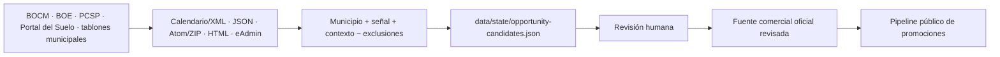

# Arquitectura de SierraNueva

## Vista general

SierraNueva es un monorepo .NET 10 con persistencia basada en archivos. El
crawler produce un contrato público estable y Blazor lo consume sin backend.

```mermaid
flowchart LR
    C["Configuración JSON"] --> D["Descubrimiento de URLs"]
    D --> H["HTTP respetuoso"]
    H --> E["Extractores por capas"]
    E --> N["Normalización y deduplicación"]
    N --> G["Geolocalización"]
    G --> Q["Validación de calidad"]
    Q --> X["Cambios y estado"]
    X --> P["JSON · CSV · GeoJSON"]
    P --> W["Blazor WebAssembly"]
    W --> M["Leaflet · OpenStreetMap"]
```

El descubrimiento administrativo forma un flujo paralelo y privado:

## Fronteras de proyectos

| Proyecto | Responsabilidad | Dependencias permitidas |
|---|---|---|
| `SierraNueva.Contracts` | DTOs, enums y contratos públicos 1.0 | BCL |
| `SierraNueva.Core` | reglas, identidad, normalización, cambios, calidad y orquestación | Contracts |
| `SierraNueva.Infrastructure` | HTML, HTTP, robots, sitemaps, PDF, Playwright, geocodificación y archivos | Core, Contracts |
| `SierraNueva.Crawler` | CLI, composición, logging y códigos de salida | Los tres anteriores |
| `SierraNueva.Web` | UI estática, filtros, detalle y mapa | Contracts |

Core desconoce AngleSharp, PdfPig y Playwright. Las integraciones se sitúan
detrás de interfaces para que puedan sustituirse o probarse sin red.

Los modelos y la orquestación del radar pertenecen a Core. Infrastructure
descarga, interpreta y persiste los feeds. Crawler compone los comandos y
Contracts/Web no conocen candidatos administrativos.

## Flujo de una ejecución

1. La CLI carga y valida ajustes, municipios, procedencia de centroides,
   fuentes y exclusiones. La baseline usa el perfil offline; una ejecución live
   requiere indicar explícitamente sus dos archivos de configuración.
2. Cada fuente habilitada aporta URLs configuradas, manuales y de sitemap.
3. El rastreador valida esquema, host, blocklist y red privada; consulta
   `robots.txt`; aplica espera, tamaño, contenido, reintentos y cancelación.
4. El HTML se procesa por JSON-LD, metadatos, texto y selectores específicos.
   Una ficha revisada puede fijar el municipio y reunir uno o varios bloques de
   contenido explícitos; si falta cualquiera, la extracción falla de forma
   cerrada. Esto evita mezclar navegación, pies o promociones relacionadas.
   Los demás valores territoriales se normalizan contra el catálogo. PDF y
   Playwright son capas opcionales.
5. Los candidatos se normalizan y reciben un identificador SHA-256 truncado.
6. Solo se fusionan duplicados concluyentes. Los ambiguos conservan una
   advertencia.
7. Se aplican coordenadas explícitas o, como último recurso, un centroide
   municipal trazable. Los 29 centroides de configuración derivan del NGMEP
   2026 del IGN en ETRS89, compatible con WGS84 en la península.
8. Se compara con `promotions-state.json`. Tres ausencias consecutivas en
   ejecuciones completas desactivan una promoción.
9. Las validaciones impiden publicar rangos imposibles, URLs inválidas y
   coordenadas fuera de rango.
10. Todos los archivos se preparan con nombres temporales y se renombran al
    final.

Si una fuente falla, no se cuentan ausencias para evitar bajas falsas. Si no
queda ninguna fuente correcta, no se sustituye el último dataset válido.
El estado privado conserva dos generaciones atómicas de
`promotions-state.json`: la lectura intenta el principal, `backup-1` y
`backup-2`; si todos son inválidos, aborta sin modificar ninguno.

## Radar de oportunidades

`discover-opportunities` lee un catálogo independiente. La configuración
predeterminada usa fixtures; el perfil live debe indicarse expresamente. El
lector admite RSS, JSON anidado de BOE, Atom, ZIP con Atom, bloques HTML
acotados por selector, el calendario/sumario XML de BOCM, tablones `eAdmin` y
portadas públicas de sedes electrónicas.
BOCM se recorre por día: la página de calendario descubre el XML oficial de la
edición y los días sin boletín no producen entradas. Los tablones municipales
usan una única página, extraen solo enlaces de detalle y fijan un municipio
validado por configuración. En `sedelectronica.es` solo se consulta la portada
permitida por `robots.txt`; nunca se accede al tablón `/board` bloqueado.
Los formatos municipales adicionales se mantienen aislados por selector o
feed: el portal de transparencia de Bustarviejo y el RSS del Ayuntamiento de
Cercedilla no amplían las reglas generales del parser.

Una entrada solo se convierte en candidato si contiene un municipio del
catálogo, una señal administrativa y contexto inmobiliario. Las exclusiones
eliminan contratos de mantenimiento, hostelería, aparcamientos y otras
coincidencias conocidas. La regla reduce ruido, pero no demuestra que la
actuación vaya a comercializar viviendas.

La identidad combina fuente, identificador externo o URL y municipio. Una
ejecución posterior actualiza el candidato sin perder su estado humano:
`new`, `monitoring`, `rejected`, `verifiedSource` o `stale`. La escritura es
atómica, rota dos backups y nunca toca `data/public`.

Los ZIP mensuales de PCSP se descargan a un temporal con límite de 512 MiB y se
procesan entrada a entrada para no mantenerlos completos en memoria. El
temporal se elimina incluso ante fallo. Una respuesta HTML del WAF aunque use
HTTP 200 se rechaza por tipo de contenido y queda como fallo parcial.

## Persistencia JSON

JSON mantiene el MVP auditable, portable y ejecutable sin servicios. El volumen
inicial es pequeño, la escritura completa es barata y los diffs son legibles.
CSV sirve a hojas de cálculo y GeoJSON desacopla el mapa del contrato principal.

El coste de esta decisión es que las consultas complejas y el historial muy
grande no escalan indefinidamente. Las interfaces de repositorio permiten
migrar a SQLite, almacenamiento de objetos o una base remota sin modificar el
contrato público.

## Identidad y cambios

La URL canónica oficial normalizada tiene prioridad. Si falta, la identidad se
deriva de nombre, municipio, promotora y zona. El valor final es un hash
determinista y no expone datos adicionales.

Se rastrean cambios comerciales: precio, disponibilidad, estado, entrega,
superficies y activación. `changes.json` conserva hasta 5.000 eventos y está
preparado para que una fase futura alimente notificaciones.

## Seguridad

- Solo `http` y `https`.
- Hosts permitidos por fuente y blocklist global.
- Bloqueo de localhost, IP privadas, link-local y esquemas alternativos.
- Resolución DNS validada al abrir cada conexión; una respuesta mixta o no
  pública se rechaza y la conexión se fija a una IP ya comprobada.
- Sin certificados inválidos, cookies persistentes ni ejecución de scripts
  descargados. El cliente aislado del radar admite cookies públicas de sesión
  en memoria para completar redirecciones, sin compartirlas con el crawler ni
  escribirlas en estado.
- Límite de redirecciones, respuesta HTML y PDF.
- JSON con `System.Text.Json`, sin deserialización polimórfica arbitraria.
- Texto de evidencia reducido y normalizado.

La validación en URL y la validación en conexión son deliberadamente
independientes: la primera descarta literales peligrosos y la segunda impide
que un host autorizado cambie a una red privada mediante DNS rebinding.

## Frontend

Blazor carga cuatro recursos en paralelo lógico: promociones, cambios, run y
GeoJSON. El filtro se ejecuta completamente en cliente y produce una única
colección que alimenta listado y mapa. Los parámetros relevantes se guardan en
la query para compartir la vista. La ficha detalla las señales de confianza;
el patrón de tabs móvil admite teclado y el detalle se presenta como diálogo
con cierre mediante Escape.

Leaflet recibe el GeoJSON generado y una lista de identificadores visibles.
Los popups se construyen con nodos y `textContent`, nunca con HTML de terceros.
La versión 1.9.4 se sirve desde el artefacto estático, sin CDN. Si Leaflet o las
teselas fallan, se muestra un mensaje y el listado conserva toda su
funcionalidad.

## Descubrimiento sin buscador comercial

El MVP no raspa Google, Bing ni DuckDuckGo y no depende de una API de búsqueda.
Esto reduce cobertura, pero hace el proceso legalmente más conservador y
reproducible. Las fuentes se incorporan mediante registro explícito, sitemaps,
enlaces internos y archivos manuales.

Una integración futura con SearXNG implementará `IUrlDiscoveryProvider`,
exigirá un endpoint controlado por el operador y permanecerá inactiva cuando no
exista configuración. Common Crawl, BOCM y transparencia municipal seguirán la
misma frontera.

## Automatización y publicación

`ci.yml` ejecuta solo fixtures y reproduce la baseline offline. El workflow
`crawl-and-deploy.yml` usa explícitamente el perfil live, conserva el estado
privado en caché de Actions, exige éxito completo antes de publicar y genera un
artefacto estático con base `/SierraNueva/`, `.nojekyll` y fallback `404.html`.
La caché nunca se copia al artefacto.

La ejecución está programada diariamente a las 06:17 `Europe/Madrid`. El
repositorio es público y Pages usa GitHub Actions como fuente. La ejecución
manual `30033934500` comprobó el flujo completo y publicó la SPA en
`https://javiig13.github.io/SierraNueva/` sin exponer `data/state`.
